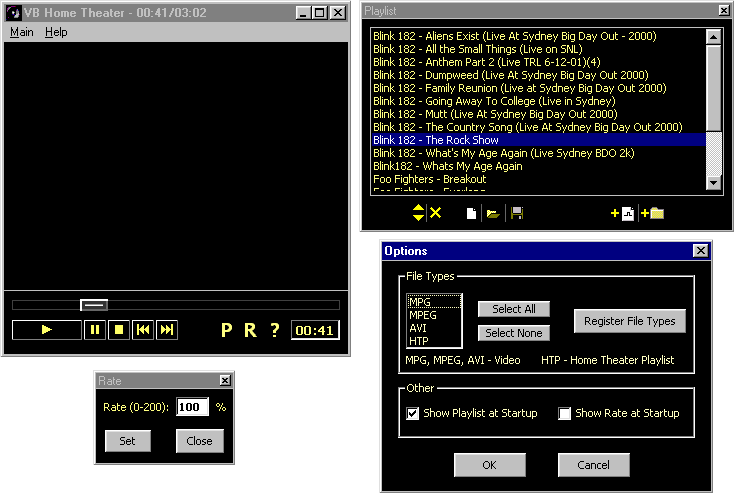



## VB Home Theater \(MUST SEE\) API Mpeg AVI Video Player \(UPDATED NO DLL\)

### Description

This is a complete MPEG AND AVI Video Player with a playlist. VB Home Theater uses no OCX its just in API calls.

You can change the RATE of the Video.

The Playlist is fully functional.

This code is a fully functional API MPEG AVI PLAYER.

Vote for me please...

Also, this code isn'n commented.

NOW VB HOME THEATER CAN PLAY AVI FILES.

NOW YOU CAN ASSOCIATE FILE TYPES.

ALT + ENTER FOR FULL SCREEN

I MADE MY OWN PLAYLIST EXTENSION.

IT HAS A TIME LINE SLIDER(WITH A LITTLE BUG)

CAN YOU HELP ME TO FIX THE TIME LINE BUG???

AND OTHER STUFF...

PLEASE VOTE FOR ME IF YOU LIKE IT.

LEAVE A FEEDBACK.
 
### More Info
 

             |
---                |---
**Submitted On**   |2001-09-27 23:25:12
**By**             |[Frederico Machado](https://github.com/Planet-Source-Code/PSCIndex/blob/master/ByAuthor/frederico-machado.md)
**Level**          |Advanced
**User Rating**    |4.8 (67 globes from 14 users)
**Compatibility**  |VB 6\.0
**Category**       |[Complete Applications](https://github.com/Planet-Source-Code/PSCIndex/blob/master/ByCategory/complete-applications__1-27.md)
**World**          |[Visual Basic](https://github.com/Planet-Source-Code/PSCIndex/blob/master/ByWorld/visual-basic.md)
**Archive File**   |[VB Home Th271629292001\.zip](https://github.com/Planet-Source-Code/frederico-machado-vb-home-theater-must-see-api-mpeg-avi-video-player-updated-no-dll__1-27423/archive/master.zip)

